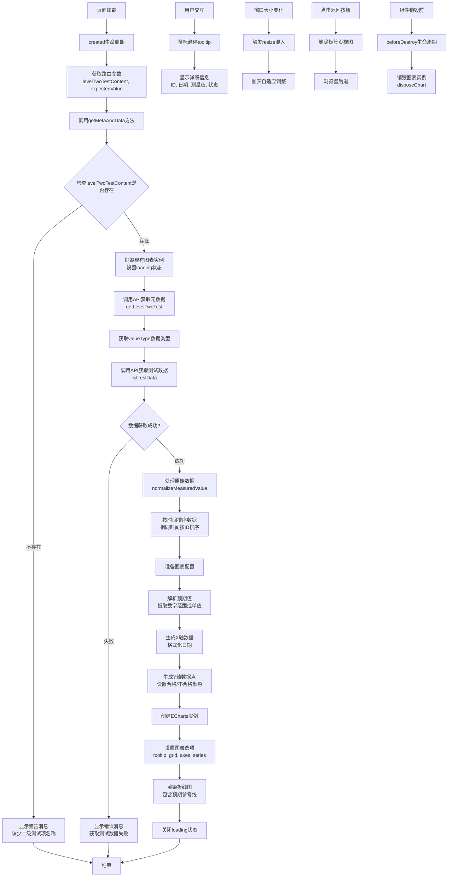

```mermaid
graph TD
    A[页面加载] --> B[created生命周期]
    B --> C[获取路由参数<br/>levelTwoTestContent, expectedValue]
    C --> D[调用getMetaAndData方法]
    
    D --> E{检查levelTwoTestContent是否存在}
    E -->|不存在| F[显示警告消息<br/>缺少二级测试项名称]
    E -->|存在| G[销毁现有图表实例<br/>设置loading状态]
    
    G --> H[调用API获取元数据<br/>getLevelTwoTest]
    H --> I[获取valueType数据类型]
    I --> J[调用API获取测试数据<br/>listTestData]
    
    J --> K{数据获取成功?}
    K -->|失败| L[显示错误消息<br/>获取测试数据失败]
    K -->|成功| M[处理原始数据<br/>normalizeMeasuredValue]
    
    M --> N[按时间排序数据<br/>相同时间按ID排序]
    N --> O[准备图表配置]
    
    O --> P[解析预期值<br/>提取数字范围或单值]
    P --> Q[生成X轴数据<br/>格式化日期]
    Q --> R[生成Y轴数据点<br/>设置合格/不合格颜色]
    R --> S[创建ECharts实例]
    
    S --> T[设置图表选项<br/>tooltip, grid, axes, series]
    T --> U[渲染折线图<br/>包含预期参考线]
    U --> V[关闭loading状态]
    
    F --> W[结束]
    L --> W
    V --> W
    
    X[用户交互] --> Y[鼠标悬停tooltip]
    Y --> Z[显示详细信息<br/>ID, 日期, 测量值, 状态]
    
    AA[窗口大小变化] --> BB[触发resize混入]
    BB --> CC[图表自适应调整]
    
    DD[点击返回按钮] --> EE[删除标签页视图]
    EE --> FF[浏览器后退]
    
    GG[组件销毁前] --> HH[beforeDestroy生命周期]
    HH --> II[销毁图表实例<br/>disposeChart]

```