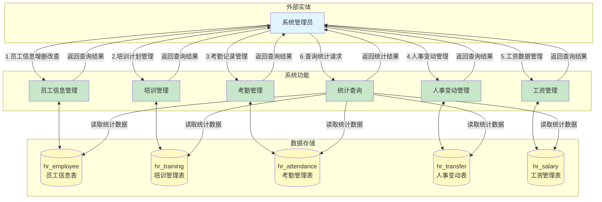

```mermaid
```mermaid
graph TD
    subgraph 外部实体
        Admin[系统管理员]
    end

    subgraph 系统功能
        P1[员工信息管理]
        P2[培训管理]
        P3[考勤管理]
        P4[人事变动管理]
        P5[工资管理]
        P6[统计查询]
    end

    subgraph 数据存储
        D1[(hr_employee<br/>员工信息表)]
        D2[(hr_training<br/>培训管理表)]
        D3[(hr_attendance<br/>考勤管理表)]
        D4[(hr_transfer<br/>人事变动表)]
        D5[(hr_salary<br/>工资管理表)]
    end

    Admin -->|1.员工信息增删改查| P1
    Admin -->|2.培训计划管理| P2
    Admin -->|3.考勤记录管理| P3
    Admin -->|4.人事变动管理| P4
    Admin -->|5.工资数据管理| P5
    Admin -->|6.查询统计请求| P6

    P1 <--> D1
    P2 <--> D2
    P3 <--> D3
    P4 <--> D4
    P5 <--> D5
    P6 -->|读取统计数据| D1
    P6 -->|读取统计数据| D2
    P6 -->|读取统计数据| D3
    P6 -->|读取统计数据| D4
    P6 -->|读取统计数据| D5

    P6 -->|返回统计结果| Admin
    P1 -->|返回查询结果| Admin
    P2 -->|返回查询结果| Admin
    P3 -->|返回查询结果| Admin
    P4 -->|返回查询结果| Admin
    P5 -->|返回查询结果| Admin

    style Admin fill:#e1f5fe
    style P1 fill:#c8e6c9
    style P2 fill:#c8e6c9
    style P3 fill:#c8e6c9
    style P4 fill:#c8e6c9
    style P5 fill:#c8e6c9
    style P6 fill:#c8e6c9
    style D1 fill:#fff9c4
    style D2 fill:#fff9c4
    style D3 fill:#fff9c4
    style D4 fill:#fff9c4
    style D5 fill:#fff9c4
```
```